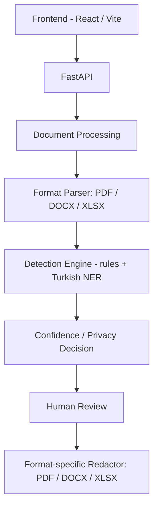

# PrivacyLens

[](https://github.com/Ayfernaz-Baygin/privacylens/actions/workflows/ci.yml)

**AI-assisted document privacy platform that detects, reviews and securely redacts sensitive information in PDF, DOCX and XLSX files.**

Detection combines rule-based validation (email, phone, national ID, IBAN, card numbers) with a Turkish named-entity recognition model (person, location, organization) — it is not a single "AI does everything" pipeline. Redaction physically removes the original content from the file rather than covering it with a visual overlay.

## Why PrivacyLens?

Finding and removing personal or sensitive data scattered across documents is tedious to do by hand and easy to get wrong — a missed email address or ID number in a "cleaned" file is a real leak. PrivacyLens provides a structured **detect → assess → review → redact** workflow: sensitive values are found consistently, given a confidence-backed privacy status, optionally reviewed by a human, and then permanently removed from the document instead of just visually hidden.

## Key Features

- Upload and process PDF, DOCX and XLSX documents
- Rule-based detectors: email addresses, Turkish mobile phone numbers, Turkish National ID (TCKN, checksum-validated), Turkish IBAN (structure-validated), payment card numbers (Luhn-validated)
- Turkish named-entity recognition for PERSON / LOCATION / ORGANIZATION
- Confidence scoring (HIGH / MEDIUM / LOW) and privacy status (SENSITIVE / REVIEW) per finding
- AUTO_REDACT / REVIEW / KEEP redaction-decision layer, with human-in-the-loop selection of REVIEW findings before redaction
- True content-removing redaction, not a black box overlay, for all three formats
- Format-preserving masks (e.g. `A**e Y****z`) instead of blank blocks, so redacted documents stay readable
- Protected document download after redaction

## How It Works

```
Upload → Parse → Detect → Review → Secure Redact → Download
```

1. Upload a PDF, DOCX, or XLSX document
2. The document is parsed with a format-specific extractor (including OCR fallback for scanned PDF content)
3. Rule detectors and the Turkish NER model find sensitive values and score them
4. Each finding gets a privacy status and a redaction action (AUTO_REDACT / REVIEW / KEEP)
5. REVIEW findings can be selected or skipped by a human before redaction
6. Selected findings are redacted directly in the document's underlying structure
7. The protected document is downloaded, and the server-side working directory is deleted once the response has fully completed

## Supported Document Formats

| Format | Analyze | Redact |
|--------|---------|--------|
| PDF    | Yes     | Yes    |
| DOCX   | Yes     | Yes    |
| XLSX   | Yes     | Yes    |

## Detection & Privacy Policy

- **EMAIL** — regex-validated structure
- **PHONE** — Turkish mobile number patterns
- **TCKN** — Turkish National ID, checksum-validated
- **IBAN** — Turkish IBAN, structure-validated
- **CARD_NUMBER** — payment card numbers, Luhn-validated
- **PERSON / LOCATION / ORGANIZATION** — Turkish named-entity recognition using [`akdeniz27/bert-base-turkish-cased-ner`](https://huggingface.co/akdeniz27/bert-base-turkish-cased-ner)

LOCATION is a named-entity label produced by the NER model (e.g. a city or place mentioned in text) — PrivacyLens does not have a dedicated postal-address detector.

Every finding gets a confidence level and a privacy status, which drive an AUTO_REDACT / REVIEW / KEEP decision. REVIEW findings are surfaced to a human before anything is redacted, rather than being silently auto-redacted or auto-ignored.

## Secure Redaction

Redaction is **not** a visual overlay. The original sensitive content is physically removed from the document's underlying structure first, and only then is a safe masked value written in its place — so the original text cannot be recovered by copy-pasting, re-opening the file in another tool, or inspecting the raw file contents.

Each format is redacted using its own structure rather than a single generic approach:

**PDF** — coordinate-based true redaction via PyMuPDF (`add_redact_annot` + `apply_redactions`): matched text regions are physically removed from the page, then a type-specific mask is rendered into the now-clean area. Multi-bbox findings (a value split across several text fragments) and repeated values (redacting only the selected occurrence) are both handled correctly.

**DOCX** — paragraphs and table cells are traversed in document order, sensitive spans are mapped back to the specific XML runs that contain them, and the original run text is replaced in place with a masked value, including cases where an entity spans multiple runs. Formatting is preserved.

**XLSX** — worksheet cells are mapped similarly and redacted directly, with cell styles preserved. Formula cells cannot be safely edited at the offset level, so a matched formula cell is fail-safe replaced as a whole (formula and cached result removed, value masked) instead of partially rewritten.

For DOCX and XLSX, tests additionally verify redaction against the raw XML/ZIP contents of the output file, not just what a re-opened document object shows, confirming the sensitive literal is actually gone from the underlying markup.

## OCR / Hybrid PDF Support

PDF text extraction handles three page types:

- **Native** text PDFs — text is read directly from the PDF's text layer
- **Scanned / image-only** PDFs — OCR fallback via Tesseract (`tur` + `eng` language data)
- **Hybrid** pages — a mix of native text and raster/scanned content on the same page, with native and OCR-derived findings redacted independently and selectively

Turkish characters render correctly in masked output on native, scanned, and hybrid pages.

## Masking Examples

Redacted values are replaced with a deterministic, format-preserving mask rather than a blank block:

| Type | Original | Masked |
|------|----------|--------|
| PERSON | `Ayşe Yılmaz` | `A**e Y****z` |
| PHONE | `05321234567` | `0*********7` |
| EMAIL (public provider) | `ayse.yilmaz@gmail.com` | `a*********z@gmail.com` |
| EMAIL (company domain) | `ayse@abc-teknoloji.com` | `a**e@a***********i.com` |
| IBAN | `TR330006100519786457841326` | `TR***********************6` |
| TCKN | `12345678901` | `***********` |
| CARD_NUMBER | `4111-1111-1111-1111` | `4***-****-****-***1` |

Well-known public email providers (Gmail, Outlook, Hotmail, Yahoo, iCloud, Yandex, Proton) keep their domain visible since it carries no personal information; the local part is still masked. Company/custom domains are masked in full, as shown above.

## Architecture



**Backend** — Python, FastAPI, PyMuPDF, python-docx, openpyxl, transformers/PyTorch (Turkish NER, CPU-only in Docker), pytest

**Frontend** — React, Vite, JavaScript, CSS

**Infrastructure** — Docker Compose, GitHub Actions CI

```
backend/
  app/
    routes/         API routes (documents.py)
    services/       parsing, detection wiring, redaction, cleanup, file validation
    detectors/      rule-based detectors (email, phone, TCKN, IBAN, card)
  tests/            pytest suite
  evaluation/       NER evaluation scripts and sample data
frontend/
  src/              React application (JSX)
```

## API Endpoints

All document endpoints are under `/api/documents`.

| Method | Path | Description |
|--------|------|-------------|
| GET | `/` | API name and version |
| GET | `/health` | Health check |
| POST | `/api/documents` | Upload a PDF/DOCX/XLSX file, returns a server-generated document ID |
| GET | `/api/documents/{id}/text` | Extract raw text from the uploaded document |
| GET | `/api/documents/{id}/analyze` | Run detection and return findings with confidence/privacy status |
| POST | `/api/documents/{id}/redact-selected` | Redact selected findings and download the protected document |
| DELETE | `/api/documents/{id}` | Delete the document and its working directory |

## Local Setup

**Backend**

```
python -m venv .venv
.venv\Scripts\activate
pip install -r backend/requirements.txt
uvicorn backend.app.main:app --reload
```

On Windows, local OCR requires Tesseract to be installed separately and available on `PATH`, with both the Turkish (`tur`) and English (`eng`) language data installed. OCR is invoked for text-layer-empty pages and uncovered raster content on hybrid native/image pages.

**Frontend**

```
cd frontend
npm install
npm run dev
```

**Configuration (optional)**

All configuration is optional; unset environment variables keep the exact defaults below, so the commands above work with no setup.

- `VITE_API_BASE_URL` (frontend, e.g. in `frontend/.env`) — backend URL the app calls. Default: `http://127.0.0.1:8000`.
- `PRIVACYLENS_UPLOAD_ROOT` (backend) — directory documents are stored in while being processed. Default: `tmp/privacylens`.
- `PRIVACYLENS_CORS_ORIGINS` (backend) — comma-separated allowed CORS origins. Default: `http://localhost:5173,http://127.0.0.1:5173`.

See `frontend/.env.example` and `backend/.env.example` for reference (non-secret) values.

## Docker Setup

```
docker compose up --build
```

- Backend: [http://localhost:8000](http://localhost:8000)
- Frontend: [http://localhost:8080](http://localhost:8080)

Uses `compose.yaml` at the repo root; the native `python`/`uvicorn` and `npm run dev` workflows above still work independently of this. The frontend's port is 8080 (not 5173) so it doesn't collide with `npm run dev` running at the same time. The Turkish NER model is not downloaded at build time — only on first real analysis request — and is cached in a named volume across container restarts. The backend image includes Tesseract and the `tur`/`eng` language data, so no separate OCR installation is needed when using Docker. The backend's PyTorch dependency is the CPU-only build to keep the image lean.

## Tests

**Backend**

```
python -m pytest
```

This is the default fast suite; `pytest.ini` excludes `slow`-marked tests from it automatically. Currently: 294 passed, 2 deselected.

```
python -m pytest -m slow
```

Runs the 2 tests excluded above: a real integration check against the actual pinned Hugging Face Turkish NER model (no mocking). Currently: 2 passed, 294 deselected. These use the model pinned in `backend/app/services/turkish_ner.py`; if it isn't already in the local Hugging Face cache, the first run may need to download it.

294 fast + 2 slow = 296 tests total.

**Frontend**

```
cd frontend
npm run build
```

## Security Considerations

- Redaction physically removes original content before writing a masked value — never a visual-only overlay (see [Secure Redaction](#secure-redaction))
- Server-generated UUID4 document IDs (client never supplies or influences an ID)
- `document_id` validated before any filesystem path is built; malformed and unknown IDs return the same 404
- 20 MB upload size limit
- Upload extension and declared MIME type checked, plus real content validation (not just metadata): PDF signature check; DOCX/XLSX are opened as ZIP archives and checked for the required internal parts
- ZIP bomb / decompression-abuse guards on DOCX/XLSX uploads: total uncompressed size, per-entry uncompressed size, compression ratio, entry count, unsafe (path-traversal-style) entry paths, and encrypted entries are all checked before the archive is parsed
- The document's working directory (source file and any generated output) is deleted right after a successful redaction response has been fully sent
- Abandoned documents (uploaded but never redacted or explicitly deleted) are removed after a 1-hour retention window, swept by a periodic background cleanup task
- No database — findings and documents are not persisted beyond the temporary working directory and its retention window
- CORS origins are explicitly configured, not wildcarded, via `PRIVACYLENS_CORS_ORIGINS`

Uploaded files are written to temporary server-side storage while they are being processed — they do not stay on disk indefinitely, but they do briefly touch disk; PrivacyLens does not process files purely in memory.

PrivacyLens assists with identifying and redacting sensitive data but does not guarantee detection of every sensitive value in a document, and its output should not be presented as automatic legal or regulatory compliance certification. Review redacted documents before relying on them.

## Known Limitations

**PDF**
- Form fields, annotations, and attachments may not be analyzed or redacted

**DOCX** — currently reliable scope: body paragraphs and table cells. Not currently covered: headers/footers, text boxes, comments, footnotes/endnotes, tracked changes, embedded objects.

**XLSX** — currently reliable scope: worksheet cells. Not currently covered: comments, headers/footers, text boxes/drawings, charts, external links, defined names, pivot caches, embedded/OLE objects.

**General** — this is a local/single-user demo application. Authentication and multi-user authorization are not implemented, so it should not be treated as a public multi-tenant production service.

Not yet implemented: broader DOCX/XLSX structure coverage (headers/footers, comments, text boxes, etc.), authentication/authorization, optional persistent metadata/database, richer NER evaluation and model monitoring.
