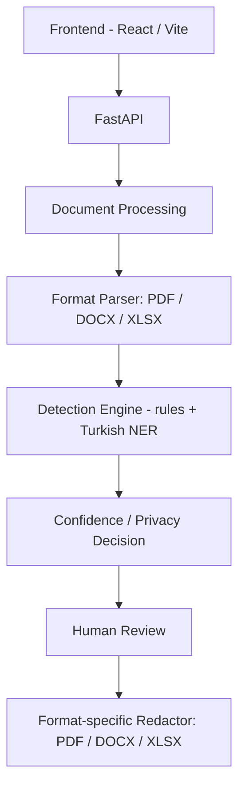

# PrivacyLens

[](https://github.com/Ayfernaz-Baygin/privacylens/actions/workflows/ci.yml)

PrivacyLens is an AI-assisted document privacy platform that detects, reviews and securely redacts sensitive information from PDF, DOCX and XLSX documents. Detection combines rule-based validation (email, phone, national ID, IBAN, card numbers) with a Turkish named-entity recognition model (person, location, organization) — it is not a single "AI does everything" pipeline.

## Why PrivacyLens?

Finding and removing personal or sensitive data scattered across documents is tedious to do by hand and easy to get wrong — a missed email address or ID number in a "cleaned" file is a real leak. PrivacyLens provides a structured **detect → assess → review → redact** workflow so sensitive values are found consistently, given a confidence-backed privacy status, optionally reviewed by a human, and then permanently removed from the document rather than just visually hidden.

## Features

- PDF, DOCX and XLSX upload
- Rule-based detection:
  - Email addresses
  - Turkish mobile phone numbers
  - Turkish National ID numbers (TCKN)
  - Turkish IBAN numbers
  - Payment card numbers, validated with the Luhn algorithm
- Turkish named-entity recognition:
  - PERSON
  - LOCATION
  - ORGANIZATION
- Confidence scoring and confidence levels (HIGH / MEDIUM / LOW) per finding
- Privacy status per finding (SENSITIVE / REVIEW)
- AUTO_REDACT / REVIEW / KEEP redaction-decision layer
- Human-in-the-loop selection of REVIEW findings before redaction
- Selective, format-aware secure redaction
- Protected document download after redaction

LOCATION is a named-entity label produced by the NER model (e.g. a city or place mentioned in text) — PrivacyLens does not have a dedicated postal-address detector.

## Secure Redaction

Each format is redacted using its own structure rather than a single generic approach:

**PDF** — coordinate-based true redaction via PyMuPDF (`add_redact_annot` + `apply_redactions`): matched text regions are located on the page and their underlying content is removed, not just covered with a black box.

**DOCX** — paragraphs and table cells are traversed in document order, sensitive spans are mapped back to the specific XML runs that contain them, and the original run text is replaced in place (length-preserving block characters), including cases where an entity spans multiple runs.

**XLSX** — sheets and cells are mapped similarly; cell values are redacted directly. Formula cells cannot be safely edited at the offset level, so a matched formula cell is fail-safe replaced as a whole (formula removed, value blocked out) instead of partially rewritten.

For DOCX and XLSX, tests additionally verify redaction against the raw XML/ZIP contents of the output file, not just what a re-opened document object shows, confirming the sensitive literal is actually gone from the underlying markup.

## Architecture



## Detection Pipeline

```
Document
  → text extraction (format-specific parser)
  → rule detectors + Turkish NER
  → confidence scoring
  → privacy status (SENSITIVE / REVIEW)
  → redaction action (AUTO_REDACT / REVIEW / KEEP)
  → optional human review of REVIEW findings
  → redaction
```

## Security / Privacy Protections

- Server-generated UUID4 document IDs (client never supplies or influences an ID)
- `document_id` validated before any filesystem path is built; malformed and unknown IDs return the same 404
- 20 MB upload size limit
- Upload extension and declared MIME type checked
- Real content validation, not just metadata: PDF signature check; DOCX/XLSX are opened as ZIP archives and checked for the required internal parts
- ZIP bomb / decompression-abuse guards on DOCX/XLSX uploads: total uncompressed size, per-entry uncompressed size, compression ratio, entry count, unsafe (traversal-style) entry paths, and encrypted entries are all checked before the archive is parsed
- The document's working directory (source file and any generated output) is deleted right after a successful redaction response has been fully sent
- Abandoned documents (uploaded but never redacted or explicitly deleted) are removed after a 1-hour retention window, swept by a periodic background cleanup task
- No database — findings and documents are not persisted beyond the temporary working directory and its retention window

Uploaded files are written to temporary server-side storage while they are being processed — they do not stay on disk indefinitely, but they do briefly touch disk; PrivacyLens does not process files purely in memory.

## Supported Formats

| Format | Analyze | Redact |
|--------|---------|--------|
| PDF    | Yes     | Yes    |
| DOCX   | Yes     | Yes    |
| XLSX   | Yes     | Yes    |

## Known Limitations

**PDF**
- Scanned/image-only pages use OCR as a fallback only when their PDF text layer is empty
- Form fields, annotations, and attachments may not be analyzed or redacted

**DOCX** — currently reliable scope:
- Body paragraphs
- Table cells

Not currently covered: headers/footers, text boxes, comments, footnotes/endnotes, tracked changes, embedded objects.

**XLSX** — currently reliable scope:
- Worksheet cells

Not currently covered: comments, headers/footers, text boxes/drawings, charts, external links, defined names, pivot caches, embedded/OLE objects.

**General** — authentication and multi-user authorization are not implemented. This repository should currently be treated as a local/single-user portfolio and demo application, not a public multi-tenant production service.

## Tech Stack

**Backend**
- Python
- FastAPI
- PyMuPDF
- python-docx
- openpyxl
- transformers / PyTorch (Turkish NER)
- pytest

**Frontend**
- React
- Vite
- JavaScript
- CSS

## Running Locally

**Backend**

```
python -m venv .venv
.venv\Scripts\activate
pip install -r backend/requirements.txt
uvicorn backend.app.main:app --reload
```

On Windows, local OCR requires Tesseract to be installed separately and
available on `PATH`, with both the Turkish (`tur`) and English (`eng`)
language data installed. OCR is invoked only for PDF pages whose text
layer is empty.

**Frontend**

```
cd frontend
npm install
npm run dev
```

### Docker (optional)

```
docker compose up --build
```

- Backend: [http://localhost:8000](http://localhost:8000)
- Frontend: [http://localhost:8080](http://localhost:8080)

Uses `compose.yaml` at the repo root; the native `python`/`uvicorn` and `npm run dev` workflows above still work independently of this. The frontend's port is 8080 (not 5173) so it doesn't collide with `npm run dev` running at the same time. The Turkish NER model is not downloaded at build time — only on first real analysis request, and is cached in a named volume across container restarts.

The backend Docker image includes Tesseract and the `tur`/`eng` language
data, so no separate OCR installation is needed when using Docker.

### Configuration (optional)

All configuration is optional; unset environment variables keep the exact defaults above, so the commands work with no setup.

- `VITE_API_BASE_URL` (frontend, e.g. in `frontend/.env`) — backend URL the app calls. Default: `http://127.0.0.1:8000`.
- `PRIVACYLENS_UPLOAD_ROOT` (backend) — directory documents are stored in while being processed. Default: `tmp/privacylens`.
- `PRIVACYLENS_CORS_ORIGINS` (backend) — comma-separated allowed CORS origins. Default: `http://localhost:5173,http://127.0.0.1:5173`.

See `frontend/.env.example` and `backend/.env.example` for reference (non-secret) values.

## Tests

**Backend**

```
python -m pytest
```

This is the default fast suite; `pytest.ini` excludes `slow`-marked tests from it automatically. Currently: 233 passed, 2 deselected.

```
python -m pytest -m slow
```

Runs the 2 tests excluded above: a real integration check against the actual pinned Hugging Face Turkish NER model (no mocking). Currently: 2 passed, 233 deselected. These use the model pinned in `backend/app/services/turkish_ner.py`; if it isn't already in the local Hugging Face cache, the first run may need to download it.

233 fast + 2 slow = 235 tests total.

**Frontend**

```
cd frontend
npm run build
```

## Example Workflow

1. Upload a PDF, DOCX, or XLSX document
2. Analyze it for sensitive data
3. Review the findings and their privacy status
4. Select any REVIEW findings to include, if needed
5. Create the redacted document
6. Download the protected document
7. The backend removes the document's working directory once the download response has fully completed

## Project Structure

```
backend/
  app/
    routes/        API routes (documents.py)
    services/       parsing, detection wiring, redaction, cleanup, file validation
    detectors/      rule-based detectors (email, phone, TCKN, IBAN, card)
  tests/            pytest suite
  evaluation/        NER evaluation scripts and sample data
frontend/
  src/              React application (JSX)
```

## Roadmap

The following are not implemented yet:

- Broader DOCX/XLSX structure coverage (headers/footers, comments, text boxes, etc.)
- Authentication / authorization
- Containerization
- CI pipeline
- Optional persistent metadata/database
- Richer NER evaluation and model monitoring

## Disclaimer / Scope

PrivacyLens assists with identifying and redacting sensitive data but does not guarantee detection of every sensitive value in a document, and its output should not be presented as automatic legal or regulatory compliance certification. Review redacted documents before relying on them.
